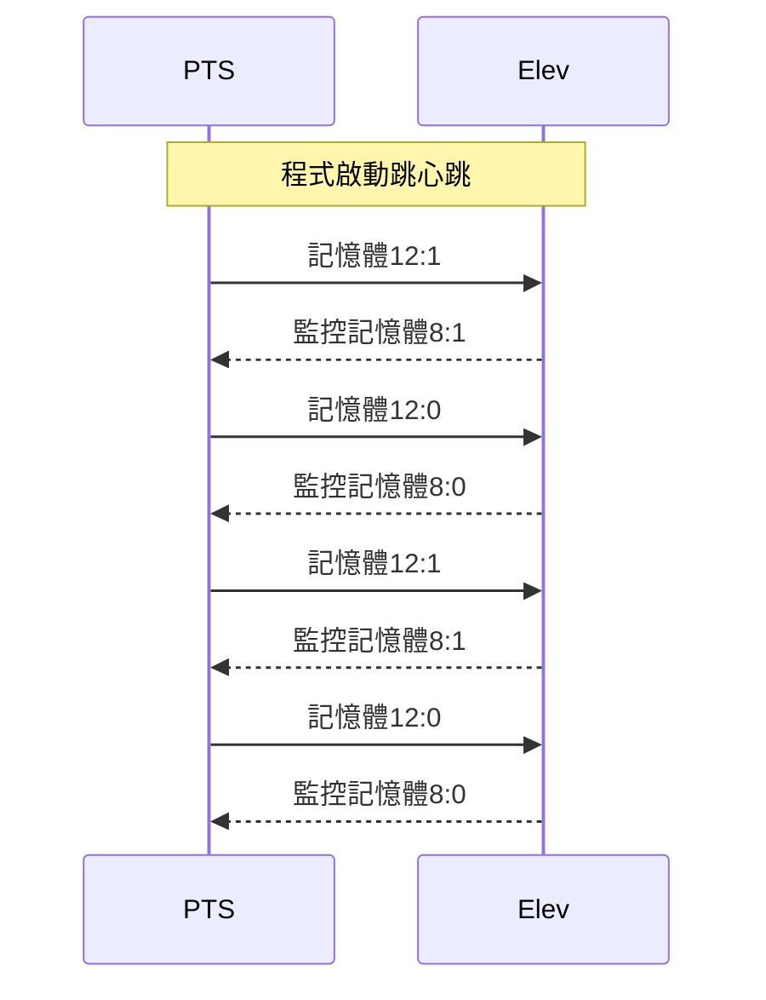
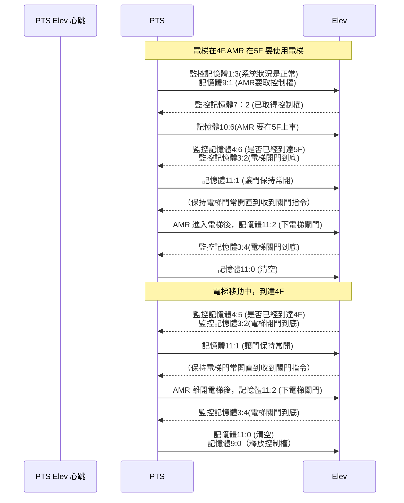

# 電梯和PTS 交握

```mermaid
sequenceDiagram

    participant PTS
    participant Elev

    note over PTS,Elev: 程式啟動跳心跳
        PTS->>Elev: 記憶體12:1
        Elev-->>PTS: 監控記憶體8:1
        PTS->>Elev: 記憶體12:0
        Elev-->>PTS: 監控記憶體8:0
        PTS->>Elev: 記憶體12:1
        Elev-->>PTS: 監控記憶體8:1
        PTS->>Elev: 記憶體12:0
        Elev-->>PTS: 監控記憶體8:0

   

```

```mermaid
sequenceDiagram

    participant PTS Elev 心跳
    participant PTS
    participant Elev

 note over PTS,Elev: 電梯在4F,AMR 在5F 要使用電梯
        PTS->>Elev:監控記憶體1:3(系統狀況是正常)　<br>記憶體9:1 (AMR要取控制權)
        Elev-->>PTS:監控記憶體7：2 (已取得控制權)
        PTS->>Elev: 記憶體10:6(AMR 要在5F上車)
        Elev-->>PTS:監控記憶體4:6 (是否已經到達5F) <BR> 監控記憶體3:2(電梯開門到底)
        PTS->>Elev: 記憶體11:1 (讓門保持常開)
        Elev-->>PTS:（保持電梯門常開直到收到關門指令）　　
        PTS->>Elev: AMR 進入電梯後，記憶體11:2 (下電梯關門)
        Elev-->>PTS: 監控記憶體3:4(電梯關門到底)
        PTS->>Elev: 記憶體11:0 (清空)
 note over PTS,Elev: 電梯移動中，到達4F
　　　　　Elev-->>PTS: 監控記憶體4:5 (是否已經到達4F) <BR> 監控記憶體3:2(電梯開門到底)
        PTS->>Elev: 記憶體11:1 (讓門保持常開)
        Elev-->>PTS:（保持電梯門常開直到收到關門指令）　　　
        PTS->>Elev: AMR 離開電梯後，記憶體11:2 (下電梯關門)
        Elev-->>PTS: 監控記憶體3:4(電梯關門到底)
        PTS->>Elev: 記憶體11:0 (清空)　<br>　記憶體9:0（釋放控制權）
　　　　　
```

