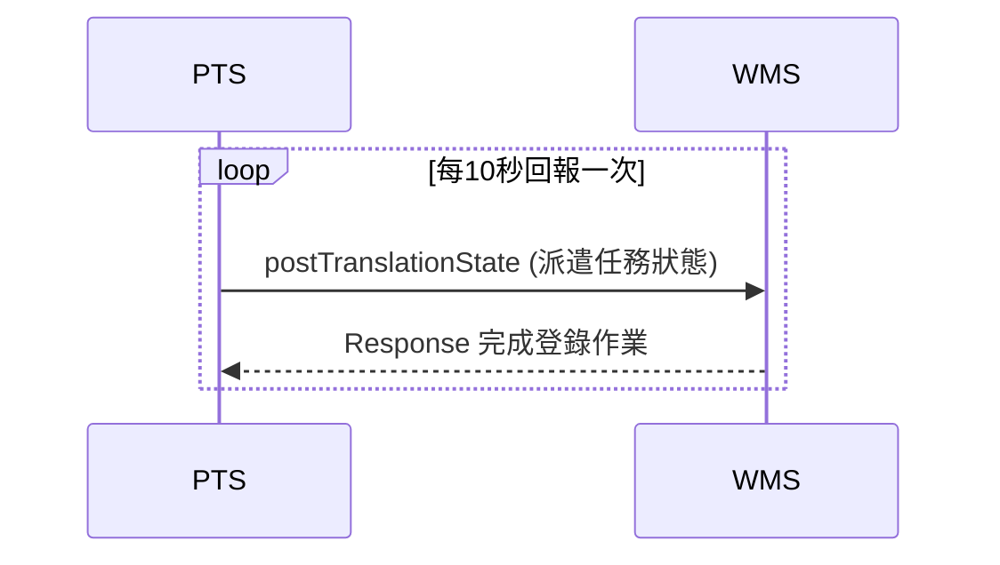
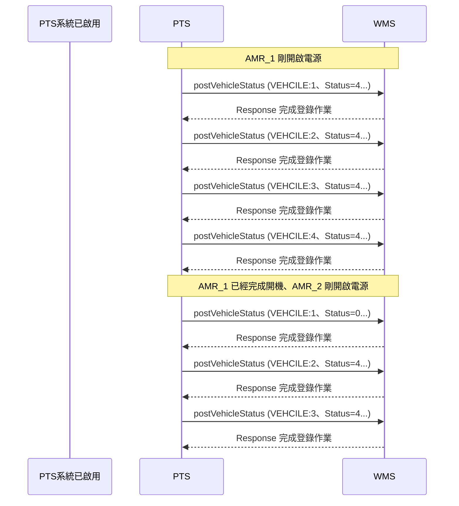

# 電梯和PTS 交握

**2.3.4 postVehicleStatus時序圖：**

```mermaid
sequenceDiagram
    participant PTS
    participant WMS

    loop 每10秒回報一次
        PTS->>WMS: postTranslationState (派遣任務狀態)
        WMS-->>PTS: Response 完成登錄作業
    end
```

## 3. 操作情境 3.1 Alive 
WMS 要下任務前，須先確認PTS系統已經啟用，PTS啟用後每隔10秒就會回報每台搬運車的狀況，請確認每台AMR 電源皆已開啟。 
若搬運車已經就緒，Status=0 ，若未開啟電源，Status=4。

 

```mermaid
sequenceDiagram
    participant PTS系統已啟用
    participant PTS
    participant WMS

    note over PTS,WMS: AMR_1 剛開啟電源
        PTS->>WMS: postVehicleStatus (VEHCILE:1、Status=4...)
        WMS-->>PTS: Response 完成登錄作業
        PTS->>WMS: postVehicleStatus (VEHCILE:2、Status=4...)
        WMS-->>PTS: Response 完成登錄作業
        PTS->>WMS: postVehicleStatus (VEHCILE:3、Status=4...)
        WMS-->>PTS: Response 完成登錄作業
        PTS->>WMS: postVehicleStatus (VEHCILE:4、Status=4...)
        WMS-->>PTS: Response 完成登錄作業

    note over PTS,WMS: AMR_1 已經完成開機、AMR_2 剛開啟電源
        PTS->>WMS: postVehicleStatus (VEHCILE:1、Status=0...)
        WMS-->>PTS: Response 完成登錄作業
        PTS->>WMS: postVehicleStatus (VEHCILE:2、Status=4...)
        WMS-->>PTS: Response 完成登錄作業
        PTS->>WMS: postVehicleStatus (VEHCILE:3、Status=4...)
        WMS-->>PTS: Response 完成登錄作業

```

