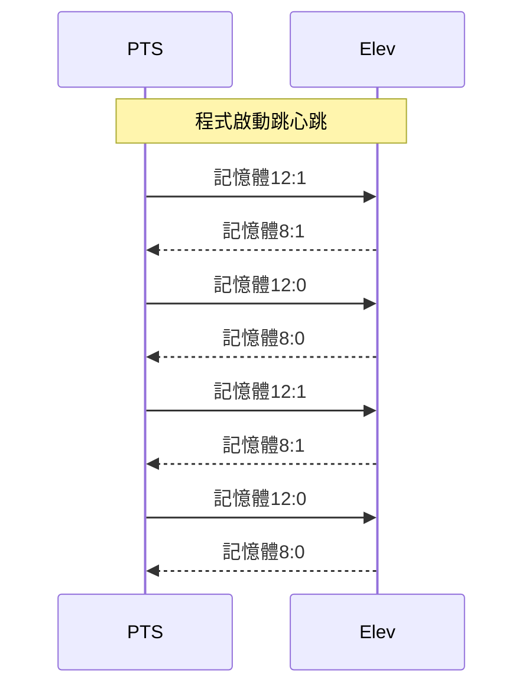
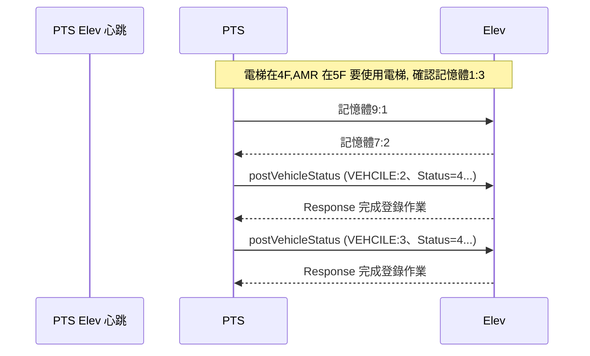

# 電梯和PTS 交握

```mermaid
sequenceDiagram

    participant PTS
    participant Elev

    note over PTS,Elev: 程式啟動跳心跳
        PTS->>Elev: 記憶體12:1
        Elev-->>PTS: 記憶體8:1
        PTS->>Elev: 記憶體12:0
        Elev-->>PTS: 記憶體8:0
        PTS->>Elev: 記憶體12:1
        Elev-->>PTS: 記憶體8:1
        PTS->>Elev: 記憶體12:0
        Elev-->>PTS: 記憶體8:0

   

```

```mermaid
sequenceDiagram

    participant PTS Elev 心跳
    participant PTS
    participant Elev

 note over PTS,Elev: 電梯在4F,AMR 在5F 要使用電梯, 確認記憶體1:3  
        PTS->>Elev:記憶體9:1
        Elev-->>PTS: 記憶體7:2
        PTS->>Elev: postVehicleStatus (VEHCILE:2、Status=4...)
        Elev-->>PTS: Response 完成登錄作業
        PTS->>Elev: postVehicleStatus (VEHCILE:3、Status=4...)
        Elev-->>PTS: Response 完成登錄作業

```

